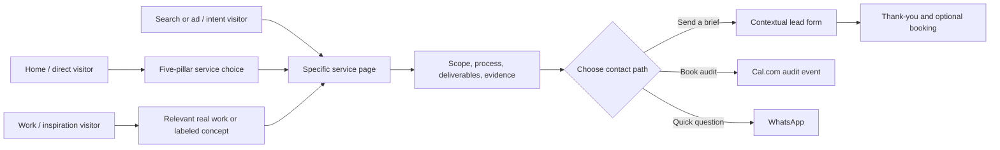

# Conversion funnel and lead-form plan

Planning date: 4 October 2026. This is a Zavino proposal, informed by the source-linked [NeuroX AI sitemap and funnel review](neuroxai-funnel-research.md). It specifies the intended experience; no form or tracking is implemented in this pass.

## What to borrow from the reference

The NeuroX review found a broad route network that repeatedly moves a visitor from a specific service/problem page to a **brief form** or direct scheduling. Its **single-page form** asks for six required pieces of information: name, company, work email, service, budget, and a project brief. It preselects service context on relevant pages, then has a thank-you page with another call option. It also presents self-initiated work candidly when client examples are limited. See the research document for coverage, URLs, and caveats. The actual submission and delivery were not tested.

Zavino should adopt the **specific page → relevant proof/explanation → contextual brief or booking** path. The route tree should remain smaller and sharper until Zavino has real depth for more pages. The homepage uses the approved small all-caps eyebrow, headline, and supporting line in [UI design base](ui-design-base.md), with “Send a brief” as its primary action. Form copy, price bands, and promises must reflect Zavino’s actual service model.

## The three contact paths

| Path | Best for | Exact action label | Destination and context |
| --- | --- | --- | --- |
| Structured brief | Visitor knows roughly what they need or wants a quote | “Send a brief” / service-specific variant | Shared lead form on Home and commercial service pages; full form at `/contact`. Service is preselected from the page, editable by visitor. |
| Audit booking | Visitor wants to talk through a site, campaign, or business problem live | “Book an audit” | Direct link to [cal.com/zavino/audit](https://cal.com/zavino/audit). State that this opens Cal.com; check actual event title, description, and availability before launch. |
| WhatsApp | Visitor has a quick question or prefers chat | “Message Zavino on WhatsApp” | Existing Zavino WhatsApp number, optionally with a short page-specific starter message. Never put a submitted brief or other personal information into a URL. |

Phone and email can remain in the footer and Contact page; the main user choice should use the three requested paths. Avoid three visually identical “Let’s talk” buttons.

## Funnel by entry point

**Service page CTA placement:** one after the useful overview, one after process/proof, and a final form block near the end. A sticky header may show “Book an audit” or “Start a project,” but should not obscure reading on mobile. The form anchor must land on the actual form container; the NeuroX review identified a service-page anchor mismatch to avoid.

**Portfolio route:** a Content Production item links to that service and can pass the relevant category into the form. A future web or automation case study should link to its own service. Do not lead users from a food reel into an unrelated SaaS case-study claim.

## Form layout and fields

Use one short, visible **single-page form** with clear groups: **About you**, **What you need**, **Project details**. This follows the observed NeuroX structure and avoids making a short brief into a wizard. Reuse the same form design on commercial pages; do not fork each service into a different schema.

| Field | Required? | Plan |
| --- | --- | --- |
| Name | Yes | Plain text, human name. |
| Company / project name | Yes, with a friendly “project name” option | Lets founders without a formal company submit. |
| Work email | Yes | Validate format; use it for reply and confirmation. Do not require a corporate domain. |
| Service | Yes | Options: five pillars, plus meaningful Web Development sub-options and “Multiple services / not sure.” Preselect from the route but keep editable. |
| Budget | Yes, with “Still estimating” | Use honest ranges matched to Zavino’s quote process and currency, agreed by the business before launch. Do not force a false budget answer. |
| Brief | Yes | Prompt: “What are you trying to make or improve? What is the current problem?” Do not enforce an arbitrary long minimum. |
| WhatsApp number / preferred contact channel | Optional | Only collect if the visitor wants a call or WhatsApp follow-up. |
| Website, timeframe, or reference link | Optional | Helpful for qualification without slowing every inquiry. Start with a URL field, not an upload. |

Explain what happens after submission in one sentence directly beside the button. Do not promise “within 24 hours” unless the team commits to and can monitor that SLA. Add a short privacy notice with the privacy-policy link. If marketing updates are ever offered, ask for separate optional consent; an inquiry is not automatic newsletter consent.

## Context and preselection

Every commercial page can render the same form with a visible heading such as “Tell us about your store” or “Tell us about the workflow.” The selected service defaults to Ecommerce, AI Automation, etc., but the visitor can change it. On `/contact`, a query parameter may preselect the service from an earlier CTA; any parameter is treated as untrusted input and mapped to a known option. Use a separate non-personal page-source value for internal reporting.

For a WhatsApp link, use a short starter such as “Hi Zavino, I’m interested in a Shopify or WordPress store.” This should be editable in WhatsApp. Never append the form data or email address to the link. The Cal.com URL stays the user-provided direct booking route, without a gate that forces form submission first.

## Submission and follow-up behavior

1. Validate required fields in the browser for immediate feedback and again on the server. Error messages sit next to the relevant fields; typed content remains intact.
2. Prevent accidental duplicate submissions and show a clear “Sending…” state. If delivery fails, say so and offer a retry plus WhatsApp as a fallback. Never show success before the lead is actually accepted.
3. Apply basic abuse controls and rate limiting, with an accessible path for legitimate users. The specific delivery/storage provider is a later implementation decision.
4. Deliver the brief to a named Zavino owner or CRM, preserving service/source context. Define the reply workflow and actual response expectation.
5. After success, show `/thank-you` with a concise confirmation, expected next step, and the Cal.com option. Keep name, email, brief, and other personal data out of its URL and analytics.

## Measurement without collecting private form content

Track `service_cta_click`, `form_start`, `form_submit_success`, `form_submit_error`, `whatsapp_click`, and `audit_booking_click`, together with page and service category. A booking-link click only measures a click, **not** a completed booking; a completed-booking measure needs Cal.com support/consent and separate verification. Do not send names, email addresses, phone numbers, project briefs, or free-text URLs into analytics. Review cookie/consent requirements when choosing the analytics product.

## Funnel-specific QA cases

- Direct visit to each route; CTA clearly names its destination.
- Form service default matches page and can be changed; unknown query values fall back safely.
- Anchor links focus or scroll to the correct form on every page.
- Required-field, email, budget uncertainty, network-error, duplicate-click, and successful-submission states.
- Keyboard and screen-reader reading order, visible focus, usable mobile keyboard types, and no hover-only controls.
- WhatsApp starter text correct per page; Cal.com link resolves and displays expected time zone/availability.
- Thank-you page is reachable only as a confirmation experience in normal flow and is not indexed as a search landing page.

## Operational signoffs before implementation

Confirm the form inbox/CRM owner, service labels, budget bands/currency, legitimate response-time statement, what the audit includes, and any appointment routing. These are business values, not design guesses. The rest of the funnel can be designed around the structure above.
