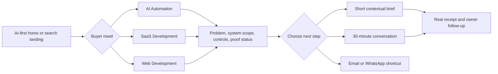

# Conversion funnel and project inquiry plan

**Planning document, updated 4 October 2026.** This specifies a future experience, not a form already working in the site. It adapts the preserved [NeuroX AI funnel research](neuroxai-funnel-research.md) to Zavino's AI automation, SaaS, and web focus.

## Conversion goal

Attract a buyer with a consequential workflow or product, help them judge fit, and make a first conversation easy. The site should quietly qualify for substantial, connected work through its examples, language, and intake. It does not need a hostile “no small jobs” banner or invented minimum spend. A visitor should be able to describe the systems, team, and desired outcome without writing a procurement document.

The path is **specific problem → relevant capability → example/proof state → scope and delivery method → brief or scheduled call**. This preserves the useful pattern on NeuroX's [service pages](https://neuroxai.com/services) and [prototype-to-production page](https://neuroxai.com/services/prototype-to-production) while using Zavino's own offer and proof.

## Calls to action and placement

| Location | Primary wording | Secondary path | Context passed |
| --- | --- | --- | --- |
| Home hero | **Discuss your project** | **Explore what we build** | General inquiry; AI/SaaS/Web choice stays editable. |
| AI Automation hub | **Map an automation project** | **Book a 30-minute call** | AI Automation preselected. |
| SaaS hub | **Discuss a SaaS build** | **Book a 30-minute call** | SaaS Development preselected. |
| Web hub | **Discuss a web platform** | **Book a 30-minute call** | Web Development preselected. |
| Supporting service sections | Named service inquiry | Booking or email | Exact supporting service preselected if active. |
| End of each core page | Contextual brief block | Direct booking | Page/source category, never personal data in URLs. |

The existing user-supplied booking destination is [cal.com/zavino/audit](https://cal.com/zavino/audit). Before implementation, verify the event's actual title, description, duration, host, availability, and time-zone behavior. Until Zavino confirms an audit deliverable, the on-site label should be **“Book a 30-minute call”** rather than promising a free audit. A direct booking link should not require prior form submission.

WhatsApp remains a useful shortcut, especially for returning clients or quick questions, but the first-screen conversion emphasis should be a serious-project brief and scheduled conversation. Make the destination explicit: “Message on WhatsApp” should open chat, not appear identical to “Discuss your project.”

## Short, qualifying brief

Use one clear page, not a long wizard. The first fields should be easy; the higher-value qualification should come from a few precise questions. Show required fields and an honest “what happens next” sentence beside submit. Do not claim a reply SLA until the owner can meet it.

| Field | Required? | Why / suggested wording |
| --- | --- | --- |
| Name | Yes | Who should Zavino reply to? |
| Company or project | Yes, accepting founders | Who is the work for? |
| Work email | Yes, any valid domain | Reliable reply path; do not force a corporate domain. |
| Project focus | Yes | **AI automation / SaaS development / Web development / AI UGC or creative / Another capability / Not sure.** Preselect from the page, keep editable. |
| What needs to change? | Yes | One free-text brief prompt: “What workflow or product is holding you back, and what should be better?” |
| Systems or data involved | Optional | Prompt examples: CRM, commerce, support, ERP, documents, existing app. Useful for complex automation without requiring technical knowledge. |
| Scale or desired outcome | Optional | Example: teams involved, volume, time lost, customer journey, or launch target. Ask for context, not fabricated ROI. |
| Timing | Optional | Discovery, target launch, or “still exploring.” |
| Budget or investment range | Optional until Zavino agrees real bands | If used, include “still scoping” and ranges that fit substantial work; do not copy NeuroX's dollar ranges. |
| Preferred contact / phone | Optional | Only collect if the visitor requests a call or WhatsApp follow-up. |

On the AI Automation page, a route-specific hint could ask: “Which systems should connect, and where must a person approve the action?” On SaaS: “Who will use the product, and what is the first useful workflow?” On Web: “Is this a site, store, portal, or custom application?” These hints can clarify the shared brief field without creating three incompatible forms.

Do not ask for customer records, secrets, or confidential datasets in the initial form. A privacy link should explain how the brief is handled. If a visitor needs an NDA, give a route to request one without falsely claiming every inquiry is automatically protected by a signed agreement.

## Form behavior and operations

1. A service CTA opens the actual form or Contact page with the relevant category preselected. The visitor can change it. Map query values to known options and keep personal information out of URLs.
2. Validate in the browser and on the server. Keep entered content on errors, show field-specific feedback, prevent duplicate submissions, and never show success before delivery succeeds.
3. Route a delivered brief to a named Zavino owner or CRM with service and source context. Confirm notification, spam controls, and an actual follow-up process before launch.
4. Confirm receipt on a real success state or a noindex thank-you page. Offer the direct 30-minute booking link there without forcing it. If delivery fails, explain the failure and offer retry plus an email/WhatsApp fallback.
5. Measure CTA clicks, form starts, submitted briefs, delivery errors, and booking-link clicks by page/service only. A booking-link click is not a completed booking. Never send names, email, phone, free-text brief, or confidential URLs to analytics.

## How wider services enter the journey

The first conversion is for AI automation, SaaS, or web work. Related needs can emerge during scoping and client work: AI UGC creative for lifecycle campaigns, custom AI inside a SaaS product, SEO for a platform launch, or brand/content work for acquisition. The site should make these capabilities findable in Services and relevant cross-links, and the team can discuss them after understanding the buyer's core problem. Do not cross-sell in a way that makes the initial offer feel unfocused.

## Reference and verification notes

NeuroX's [home](https://neuroxai.com/), [services](https://neuroxai.com/services), and [work](https://neuroxai.com/work) show the benefit of a concise form, direct booking, service context, and candid proof. The [research file](neuroxai-funnel-research.md) preserves its exact observed fields, selected options, page coverage, thank-you path, and one anchor mismatch. Those details should remain available to the next builder. Zavino should adapt the pattern, not copy its pricing, guarantee, response-time promise, or form delivery assumptions.

## Acceptance checks for a future build

- A buyer can understand the offer and reach a project conversation from the first screen on desktop and mobile.
- Each core service CTA carries the correct editable context to the same form.
- Form, booking, email, and WhatsApp destinations work and clearly state what opens.
- The form can be completed with keyboard and screen reader; errors, sending, failure, and success states are clear.
- A real owner receives a test submission; a failed delivery never produces a false success state.
- No private inquiry contents enter URLs or analytics.
