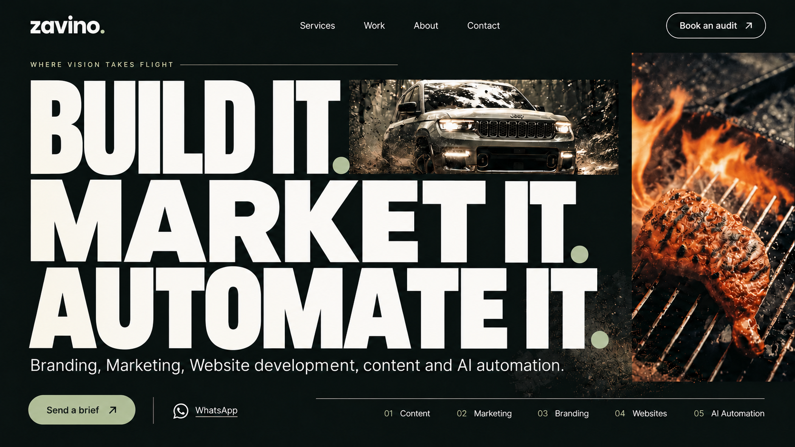
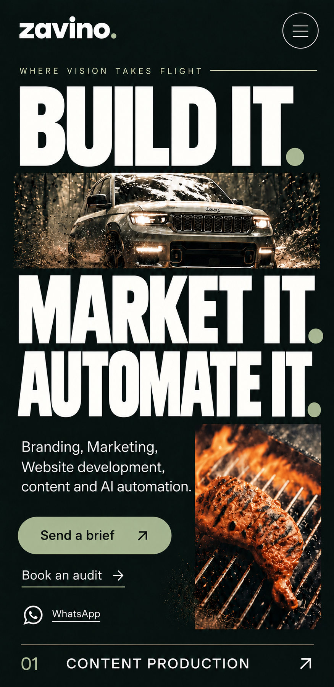

# Approved homepage concept

**03 — Typographic reel** is the chosen UI base. The desktop and mobile images below now show the approved copy. They are still frames of a scroll-responsive design, not a depiction of its image transitions. The interaction specification and implementation checks live in [UI design base](ui-design-base.md).

**Approved small all-caps eyebrow:** “WHERE VISION TAKES FLIGHT”

**Approved headline:** “Build it. Market it. Automate it.”

**Approved supporting line:** “Branding, Marketing, Website development, content and AI automation.”

## Desktop starting frame

The small tracked eyebrow and its fine rule sit above the three dominant phrases. A wide campaign-image aperture cuts through the type; a second, narrow crop sits to the right. These images are representative starting frames. During scrolling, approved stills will replace them rapidly through short fade-in/fade-out transitions.

## Mobile starting frame

The eyebrow stays small and all caps above the vertical headline sequence. The horizontal image aperture separates the first two beats; the smaller crop sits beside the supporting line. Brief, audit, and WhatsApp actions follow in a clear tap order. A full-width service row begins the five-pillar index.

## What the images establish

Use the layout, copy hierarchy, palette, and selective image placement as the base. The actual site must render the words as text and implement the scroll-reactive media as an interaction. Final image crops, rights, truthful project attribution, responsive behavior across device sizes, and all links need review. The [page experience blueprints](page-experience-blueprints.md) describe the sections after the hero.
